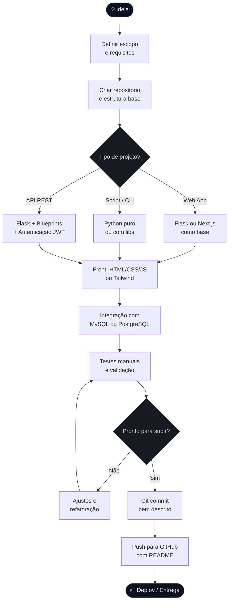

  
  
  
  

---

## Sobre mim

Desenvolvedor júnior em formação, direto de Manaus/AM. Curso Análise e Desenvolvimento de Sistemas e construo projetos próprios pra consolidar conhecimento na prática — não só no papel.

Tenho trabalhado com Python, Flask, HTML, CSS e MySQL, montando sistemas como controle financeiro, autenticação e APIs REST. Também uso Git no dia a dia e gosto de código limpo, bem estruturado e com propósito.

Ainda estou no começo, mas cada projeto é mais um passo.

---

## Stack

**Front-end**

**Back-end & Banco de Dados**

**Ferramentas**

---

## Estatísticas

> As imagens podem demorar alguns segundos pra carregar — dependem de APIs externas.

  
  &nbsp;
  

  

  

---

## Fluxo de desenvolvimento

Como organizo um projeto do zero até o deploy:

---

## O que estou aprendendo agora

- Aprofundando TypeScript e Next.js na prática
- Estudando estrutura de APIs REST com boas práticas (versionamento, autenticação, documentação)
- Explorando Docker pra padronizar ambientes de desenvolvimento

---

  <i>"Código que funciona é o começo. Código que você entende amanhã é o objetivo."</i>

